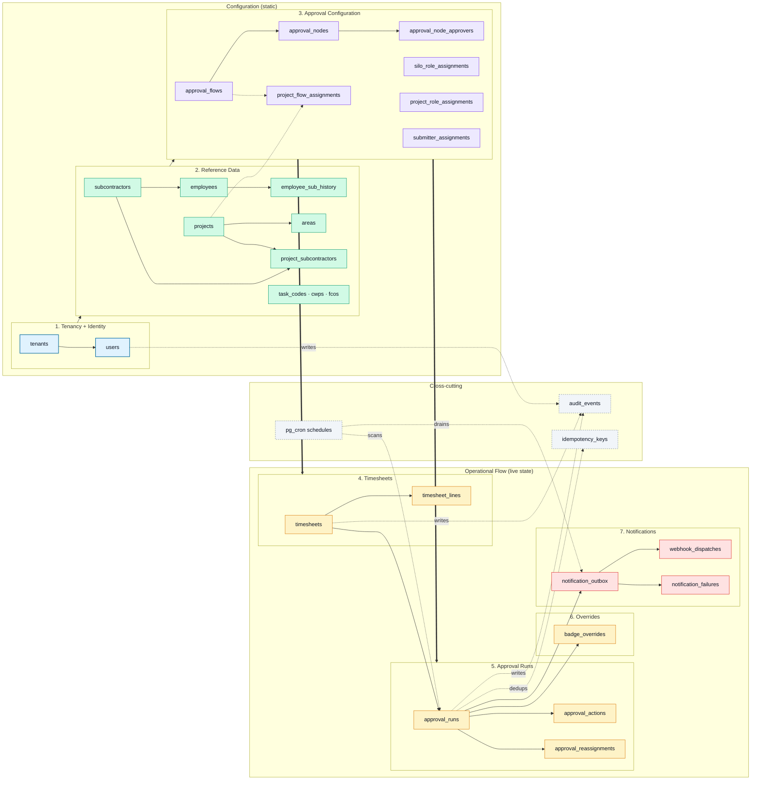

# Invenio Timekeeping — Backend Data Architecture

An L-shape view of the backend data model. The **vertical arm** on the left is
static configuration (tenancy → reference data → approval setup). The
**horizontal arm** extending right is operational state (timesheet lifecycle
→ approval runs → overrides → notifications). A thin cross-cutting layer
handles audit, idempotency, and cron-driven housekeeping.

Rendered preview: https://l.mermaid.ai/K1TcFZ

## How to read it

**Vertical arm (configuration, top→bottom):**

1. **Tenancy + Identity** — everything is tenant-scoped. Every other table
   carries `tenant_id`; RLS keys off `auth.jwt() -> 'tenant_id'`.
2. **Reference data** — the static nouns (people, places, codes). Reference
   tables are `tenant_id`-scoped and admin-only for writes; all authenticated
   users can SELECT their tenant's rows.
3. **Approval configuration** — templates (flows → nodes → approvers) plus
   effective-dated assignments (flow-per-project, role-per-silo/project,
   submitter-per-silo). Changes here ride new runs, not in-flight ones.

**Horizontal arm (operational, left→right):**

4. **Timesheets** — `timesheets` is the header row with state-machine status;
   `timesheet_lines` are the day-by-day hours.
5. **Approval runs** — one run per submitted timesheet. `approval_actions` is
   the audit trail; `approval_reassignments` layers admin targeted
   reassignments on top of the flow's configured approver pool.
6. **Overrides** — `badge_overrides` captures retroactive
   badge-vs-submitted-hours reconciliation (spec §7.7). Cascades back to the
   parent run when resolved as badge-canonical.
7. **Notifications** — `notification_outbox` is the durable queue; the
   drain-notifications Edge Function claims rows and dispatches via Resend +
   webhooks. `webhook_dispatches` dedups per (tenant, run, event).

**Cross-cutting:**

- `audit_events` collects domain actions that don't have their own audit
  table (user lifecycle, flow edits, etc.).
- `idempotency_keys` caches RPC results for 24h so duplicate submits
  replay the first response.
- `pg_cron` drives drain-notifications (every minute),
  reconcile-stuck-sending (every 5 min), and emit-stall-notifications
  (hourly).

## Who writes what

| Layer | Who writes |
|-------|------------|
| Tenancy + identity | provisioning scripts + admin Edge Functions (invite, revoke, restore, change-role) |
| Reference data | admins via PostgREST + RLS (`admin_insert`/`admin_update`/`admin_delete` policies) |
| Approval configuration | admins via PostgREST; Phase B importer supports bulk load |
| Timesheets | submitter via PostgREST (status=draft/open) + SECURITY DEFINER RPCs for state transitions |
| Approval runs | SECURITY DEFINER RPCs only (approve, reject, reassign, override, recall) |
| Notifications | system only — trigger `notify_on_approval_action` on each `approval_actions` insert |
| Audit | every mutating RPC writes one row; Edge Functions write via `writeAudit()` helper |
